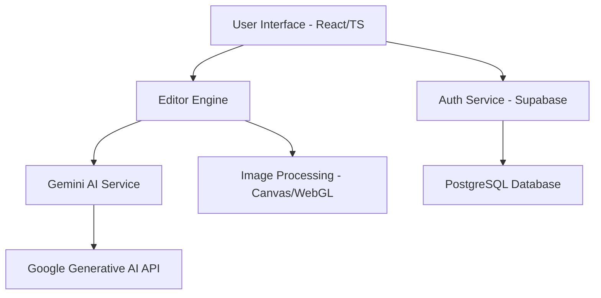

# FeasiPix AI

<div align="center">
  
  <h3>Advanced Generative AI Image Editor</h3>
  <p>Professional-grade image transformations powered by Google Gemini Vision & Supabase.</p>

  [](https://opensource.org/licenses/MIT)
  [](https://reactjs.org/)
  [](https://vitejs.dev/)
  [](https://www.typescriptlang.org/)
  [](https://supabase.io/)
</div>

---

## 📖 Table of Contents
- [Overview](#-overview)
- [Key Features](#-key-features)
- [Architecture](#-architecture)
- [Getting Started](#-getting-started)
  - [Prerequisites](#prerequisites)
  - [Environment Configuration](#environment-configuration)
  - [Local Setup](#local-setup)
- [Usage Guide](#-usage-guide)
- [Security](#-security)
- [Roadmap](#-roadmap)
- [Contributing](#-contributing)
- [License](#-license)
- [Contact](#-contact)

---

## 🌟 Overview

**FeasiPix AI** is an industrial-standard generative image editing platform. Unlike traditional editors that require manual pixel manipulation, FeasiPix leverages the **Google Gemini Pro Vision** model to understand and execute complex editing instructions through natural language. 

The platform is designed for both casual creators and professionals who need high-fidelity results without the steep learning curve of traditional software.

## ✨ Key Features

### 🪄 Generative Transformation
- **Natural Language Editing**: Swap backgrounds, change clothing, or add elements by simply describing them.
- **Context-Aware Modification**: The AI understands the scene geometry and lighting for realistic results.

### 🛡️ Core Subject Integrity
- **Face Preservation**: Advanced masking techniques ensure the subject's face and skin tone remain 100% authentic.
- **Subject Extraction**: Intelligent isolation of foreground elements.

### 🎨 Specialized Creative Tools
- **Portrait Retouching**: Professional-grade skin smoothing and lighting enhancement.
- **Asset Generation**: Create logos, stickers, and mascots from scratch.
- **Utility Suite**: Built-in background remover, face swapper, and QR code generator.

## 🏗️ Architecture



## 📁 Project Structure

```text
feasipix-ai/
├── components/       # UI Components & Feature Pages
├── contexts/         # React Contexts (Auth, Theme)
├── services/         # API & AI Service Integrations
├── App.tsx           # Main Application Routing
├── EditorPage.tsx    # Core Editor Workspace
├── index.tsx         # Application Entry Point
├── index.html        # Main HTML Template
├── supabase_schema.sql # Database Table Definitions
├── vite.config.ts    # Vite Build Configuration
├── tsconfig.json     # TypeScript Configuration
├── .env.example      # Environment Variable Template
└── README.md         # Project Documentation
```

## 🚀 Getting Started

### Prerequisites
- **Node.js**: v18.0.0 or higher
- **NPM**: v9.0.0 or higher
- **Google Cloud Console**: Access to Gemini API Key
- **Supabase Account**: For database and authentication services

### Environment Configuration
1. Clone the repository:
   ```bash
   git clone https://github.com/mr2340/feasipix-ai.git
   cd feasipix-ai
   ```
2. Copy the example environment file:
   ```bash
   cp .env.example .env
   ```
3. Populate the variables in `.env`:
   - `VITE_GEMINI_API_KEY`: Your Gemini API Key.
   - `VITE_SUPABASE_URL`: Your Supabase Project URL.
   - `VITE_SUPABASE_ANON_KEY`: Your Supabase Anonymous Key.

### Local Setup
```bash
# Install dependencies
npm install

# Start development server
npm run dev

# Build for production
npm run build
```

## 📖 Usage Guide

1. **Authentication**: Sign up or log in via the Supabase-powered auth portal.
2. **Upload**: Drag and drop your image into the workspace.
3. **Prompting**: Enter your instruction in the command bar (e.g., *"Put me in a futuristic cyberpunk city"*).
4. **Compare**: Use the built-in comparison slider to view Before/After results.
5. **Export**: Download high-resolution exports in PNG or JPG format.

## 🔒 Security

We prioritize data privacy and API security:
- **Client-Side Security**: No API keys are hardcoded; all secrets are managed via Vite's environment variables.
- **Safe Prompting**: Integrated safety filters for AI-generated content.
- **Session Management**: Secure JWT-based sessions handled by Supabase.

## 🗺️ Roadmap

- [ ] **v1.1**: Integration with Stable Diffusion for localized inpainting.
- [ ] **v1.2**: Multi-layer editing support.
- [ ] **v1.3**: Team collaboration workspaces.
- [ ] **v2.0**: Video frame-by-frame generative editing.

## 🤝 Contributing

Contributions are welcome! Please follow these steps:
1. Fork the Project.
2. Create your Feature Branch (`git checkout -b feature/AmazingFeature`).
3. Commit your Changes (`git commit -m 'Add some AmazingFeature'`).
4. Push to the Branch (`git push origin feature/AmazingFeature`).
5. Open a Pull Request.

## 📄 License

Distributed under the MIT License. See [LICENSE](LICENSE) for more information.

## 📧 Contact

**GHD Codes** - [Project Link](https://github.com/mr2340/feasipix-ai)

---
<p align="center">
  Built with ❤️ for the creative community.
</p>
